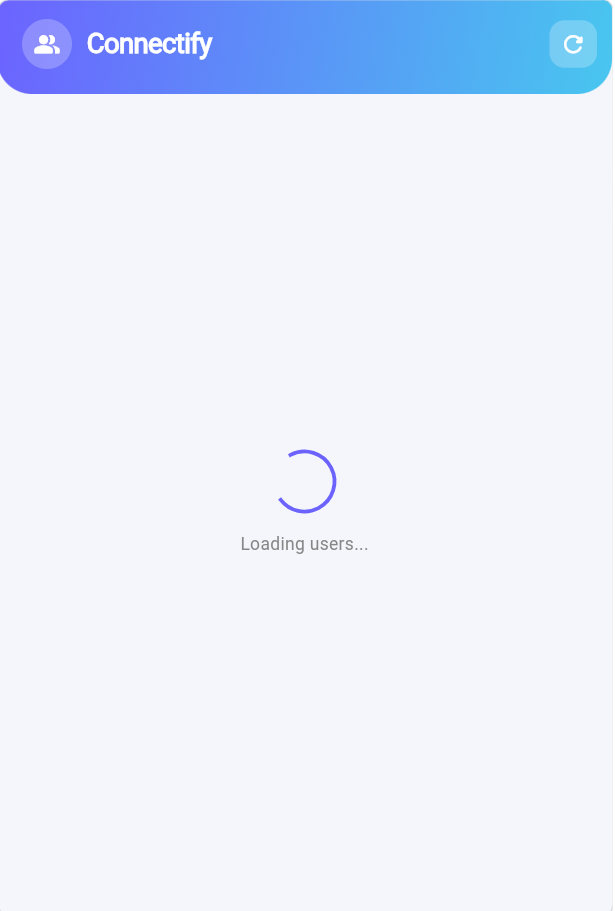
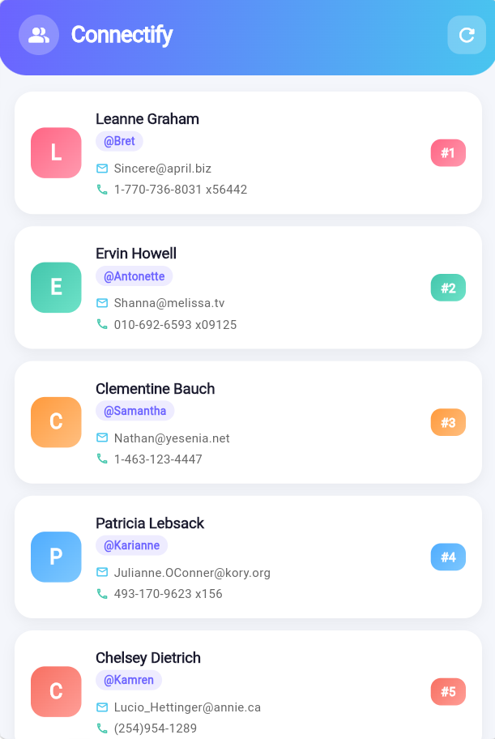
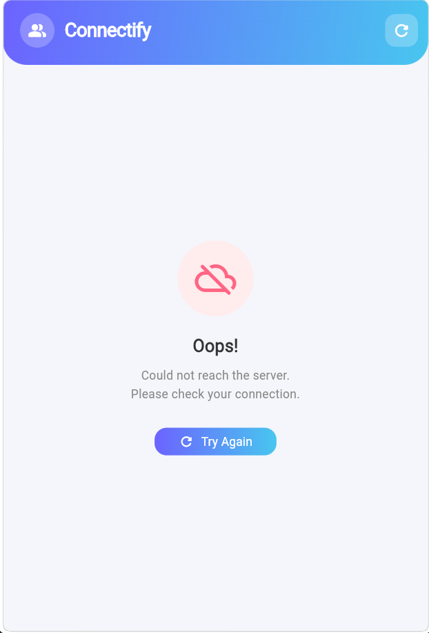

# Connectify

A Flutter mobile application that fetches and displays user contact information from a public REST API. Built as part of the **API Integration and Testing Activity** for the course *Application Development and Emerging Technologies*.

---

## About the App

Connectify connects to the [JSONPlaceholder Users API](https://jsonplaceholder.typicode.com/users) and displays a list of user profiles in a clean, colorful card-based interface. Each card shows the user's name, username, email address, and phone number.

The app demonstrates a complete API request-response flow including loading, success, empty, and error states.

---

## Features

- Fetches real data from a public REST API using the `http` package
- Displays users in a scrollable list of gradient cards
- Shows a loading spinner while data is being fetched
- Shows a friendly error screen if the request fails
- Shows an empty state if no data is returned
- Pull-to-refresh and AppBar refresh button support
- Clean and lively UI with gradient header and colorful avatars

---

## Screenshots

| Loading | Success | Error |
|---|---|---|
|  |  |  |

---

## API Used

| Detail | Value |
|---|---|
| API Name | JSONPlaceholder Users API |
| Endpoint | `https://jsonplaceholder.typicode.com/users` |
| Method | GET |
| Response Type | JSON Array |

---

## Project Structure

```
lib/
├── main.dart                  # App entry point and theme setup
├── models/
│   └── user_model.dart        # Converts JSON into a Dart UserModel object
├── services/
│   └── api_service.dart       # Handles HTTP GET request and JSON decoding
└── screens/
    └── users_screen.dart      # Main screen with all four UI states

test/
├── user_model_test.dart       # Unit tests for model conversion and validation
└── widget_test.dart           # Smoke test for app launch
```

---

## Getting Started

### Requirements
- Flutter SDK 3.x
- Android emulator or physical Android device
- Internet connection

### Installation

1. Clone the repository
```bash
git clone https://github.com/YOUR_USERNAME/Connectify.git
cd Connectify
```

2. Install dependencies
```bash
flutter pub get
```

3. Run the app
```bash
flutter run
```

4. Run unit tests
```bash
flutter test
```

---

## Dependencies

| Package | Version | Purpose |
|---|---|---|
| `http` | ^1.6.0 | Sending HTTP GET requests to the API |
| `flutter_test` | SDK | Unit and widget testing |

---

## Test Results

```
00:08 +8: All tests passed!
```

8 tests covering:
- `UserModel.fromJson()` model conversion
- Field validation (id, email, name)
- Empty list checking
- App launch smoke test

---

## Activity Info

| Item | Detail |
|---|---|
| Course | Application Development and Emerging Technologies |
| Activity | API Integration and Testing |
| API | JSONPlaceholder Users API |
| Flutter Version | 3.44.2 |
